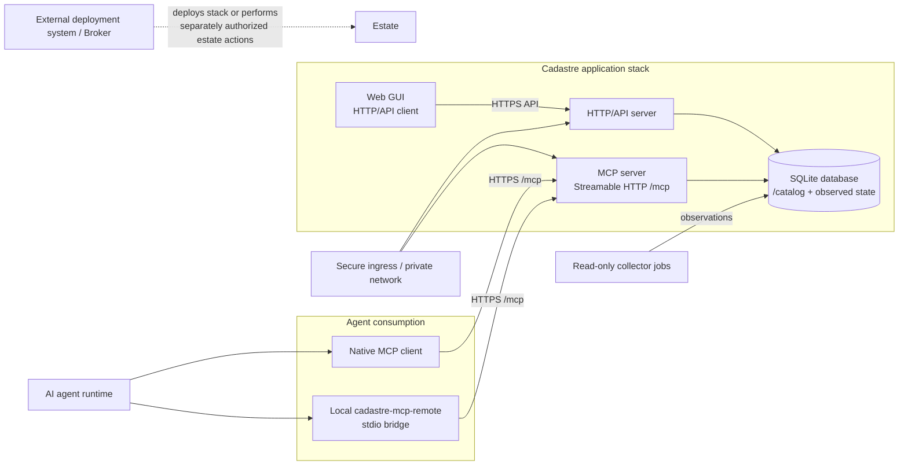

# Cadastre application architecture

Status: target product architecture, revised 2026-08-09. This document defines
the application stack Cadastre is becoming. It distinguishes the target design
from components currently implemented in this repository; a documented gap is
not a completed feature.

## 1. Product boundary

Cadastre is a stateful application for recording infrastructure knowledge and
serving it securely to humans and AI agents. A normal installation contains:

- a persistent SQLite database;
- an HTTP/API server;
- an MCP server exposing standard Streamable HTTP at `/mcp`;
- a browser GUI consuming the authenticated HTTP/API surface; and
- secure deployment and client configuration around those components.

Collectors are separate jobs or workers that populate observed evidence. An
agent-side MCP client is part of the consumption path, but does not belong in
the Cadastre server container. A client may be native to the agent product or
may be the Cadastre-provided local stdio bridge.

Cadastre runs its own application services, but it is not an estate control
plane. It does not deploy workloads, mutate DNS/VPN/orchestrator state,
reconcile drift, or return secret values. Deployment systems, ingress, secret
managers, and any Broker remain external boundaries.



The GUI is a product component even when deployed separately as static assets.
The repository provides the HTTP contract and the GUI source artifact under
`ui/`. External publication and deployment evidence must not be hidden by
calling the HTTP API “the GUI.”

The GUI is implemented under `ui/` and follows the HTTP/API boundary described
below. Agent-side native-client and bridge requirements are in
[AGENT-CLIENT.md](AGENT-CLIENT.md).

## 2. Component inventory and status

| Component | Responsibility | State or credentials | Current repository status |
|---|---|---|---|
| SQLite database | Durable catalog, observed evidence, revisions, audit, backups | `/var/lib/cadastre`; no secret values | Implemented |
| HTTP/API server | JSON API, OpenAPI, health/readiness, authenticated catalog operations | TLS and auth supplied at runtime | Implemented |
| MCP server | Standard Streamable HTTP `/mcp`; eight canonical read tools, plus an off-by-default write set and any enabled module's tools | MCP auth scope and TLS supplied at runtime | Implemented locally; publication/deployment remain release evidence |
| GUI | Human-facing browser application over the HTTP/API contract | Browser session/identity; never direct DB access | Implemented under `ui/`; publication is release evidence |
| Optional modules | Entity kinds, queries, and adapter surface a catalog opts into by configuration | `modules.yaml` beside the databases; no credentials | Implemented (`src/cadastre/modules/`); `manifest` is the only module |
| Agent-native MCP client | Connects directly to remote `/mcp` | Agent/product-managed auth | External client capability |
| `cadastre-mcp-remote` | Local stdio MCP server that forwards to remote `/mcp` | Protected endpoint/token reference | Implemented and tested |
| Collectors | Read upstream systems and write observed snapshots | Plugin-specific protected config | Implemented as separate collector path; live access varies |
| Ingress / TLS edge | Secure network exposure and optional routing | Certificates, trust anchors, identity policy | External deployment component |
| Broker | Scoped infrastructure execution and credential injection | Credentials never enter query layer | External; not shipped as the Cadastre app |

“Implemented” means repository behavior is covered by tests. It does not mean a
published image or a live estate deployment exists.

## 3. State and data ownership

The running application is stateful. The HTTP server and MCP server are two
interfaces over the same catalog data model and must not implement separate
business logic or maintain divergent caches.

```text
/var/lib/cadastre/
  catalog.sqlite3       declared intent, policy, annotations, audit
  observed.sqlite3      current source evidence and observation history
  plugins.yaml          configured collector sources (collector host)
  modules.yaml          which optional modules this catalog activates
  backups/               operator-managed backup outputs
```

Both YAML files also resolve from `declared/` for file-tree catalogs and
interchange bundles. `modules.yaml` is part of the deployment's persistent
state, not a build-time choice: a catalog that has written module-owned rows
records that requirement inside `catalog.sqlite3`, and an application that has
the module disabled refuses to write, export, or import it rather than serving a
catalog smaller than it is.

The two databases are logically separate transaction domains. They may share a
volume, but backup and restore must cover both with matching manifest metadata.
Collectors should normally be separate processes so collection credentials and
failure cannot compromise the query servers. If a deployment co-locates a
collector, that is an explicit topology decision with an independently tested
failure boundary.

Rules that apply to every interface:

- every response includes per-source provenance, `as_of`, and trust state;
- secret values never enter the database, bundles, image, URL, argv, logs, or
  agent-facing output;
- catalog writes change only the Cadastre map and pass the write gate;
- source-authoritative entities cannot be invented by a catalog-only write;
- observed data is treated as untrusted data, including prompt-shaped text;
- no server route invokes deployment, a Broker, DNS, VPN, a container runtime,
  or an upstream mutation API.

## 4. Interfaces

### HTTP/API server

The API server serves the GUI, operators, and non-MCP integrations. Its read
surface is `/brief`, `/context-for`, `/question`, `/lookup/{id}`, `/drift`,
`/observations`, `/stale`, `/sources`, `/plugins`, `/security-check`,
`/schema`, `/version`, and the health/readiness routes. `/check` uses an
explicit check scope. Catalog writes — `/add`, `/update`, `/delete`,
`/annotate`, `/accept`, `/leave-contested`, `/acknowledge` — are separate,
authenticated, audited, and disabled by default for remote deployments.

An enabled module adds its own routes under its own prefix from the same
operation registry; `manifest` adds the six `/manifest/*` reads. With every
module disabled those paths do not exist and the OpenAPI document does not
mention them. `/health/ready` carries a `modules` map of capability flags so a
GUI or client can show module navigation without duplicating activation logic;
it is a hint, never an authorization surface — each route enforces activation
itself.

Non-loopback HTTP requires TLS and authentication. Supported identity profiles
are scoped bearer credentials, mTLS principal mapping, and explicitly trusted
proxy identity. The service never trusts arbitrary forwarded headers.

### MCP server

The MCP server exposes standard Streamable HTTP at `/mcp`, with the canonical
read tools `brief`, `version`, `context_for`, `check`, `lookup`, `drift`,
`question`, and `observations`. It is a server endpoint, not an agent-side
client. MCP clients must establish the standard session and authenticate
through the configured secure transport.

Two sets are conditional. Write tools — `add`, `update`, `annotate`, `accept`,
`leave_contested`, `acknowledge` — are listed only when the operator enabled
writes *and* the connecting principal holds `catalog.write`; `delete` is never
exposed over MCP. An enabled module's tools are listed only for a catalog that
enabled it; `manifest` adds six prefixed `manifest_*`. Both sets appear through
the remote bridge automatically, because the bridge lists exactly what the
remote returns.

### GUI

The GUI is a browser client of the HTTP/API server. It must not import Python
core modules, mount the SQLite volume, or obtain a privileged path around HTTP
authorization. It should provide human-readable views of provenance, stale,
contested, unknown, and omitted data, and link procedural answers to retained
runbooks. It is implemented under `ui/` and consumes only documented routes; it
holds no ranking, join, or catalog logic of its own, and it discovers which
module navigation to show from the `/health/ready` capability flags. External
publication and deployment remain release evidence rather than a repository
claim.

### Agent-side MCP client

There are two supported client modes:

```text
Native MCP-capable agent
  agent process ──TLS/HTTPS──> Cadastre MCP server /mcp

Stdio-only agent
  agent process ──stdio──> cadastre-mcp-remote
                         └─TLS/HTTPS──> Cadastre MCP server /mcp
```

The native client requires no Cadastre package installation. The stdio mode
requires the Cadastre bridge and its MCP client dependency installed on the
agent host. The bridge is not a local catalog server and must fail closed when
the remote endpoint, TLS validation, or authentication configuration is absent.
Remote-only mode must never silently fall back to a local data directory.

## 5. Security model for agent access

The secure path is a deployment invariant, not a client convention:

1. the agent connects to an approved HTTPS/MCP endpoint;
2. TLS hostname and trust anchor are validated;
3. the server authenticates the client using a scoped token, mTLS, or a trusted
   identity proxy;
4. the server authorizes the requested operation with default deny;
5. the server returns structured data with provenance and uncertainty; and
6. audit metadata is written before any catalog write result is returned.

Tokens are supplied to the server or local bridge through protected files or
workload identity. They are never placed in MCP URLs, command arguments,
catalog data, repository files, or logs. A GUI may use the deployment's normal
browser identity mechanism, but it remains subject to the same API scopes.

## 6. Supported deployment shapes

The supported topologies are documented with network flows, ports, and protocol
boundaries in [DEPLOYMENT.md](DEPLOYMENT.md):

1. local development: all components needed for local work on one machine;
2. remote single-host stack: database, HTTP server, MCP server, and GUI assets
   on one deployment target behind a secure private ingress;
3. split application stack: database and backend services on the target, GUI
   separately hosted, with one secure ingress policy for agent/API access; and
4. development/test: ephemeral SQLite plus loopback API/MCP processes.

The production repository implements the backend, client bridge, and GUI source
artifact. A topology that claims the full product stack must deploy the
explicitly versioned GUI artifact alongside the backend services.

## 7. What remains outside Cadastre

Cadastre owns application state and query behavior. It does not own:

- image publication, registry signing, or deployment orchestration;
- TLS certificate issuance or DNS/VPN administration;
- secret-manager operation or secret values;
- agent product MCP client implementations; or
- Broker execution and live-estate mutation.

Those systems are required for some supported deployments, but their state must
be recorded as deployment evidence rather than implied by this repository.
