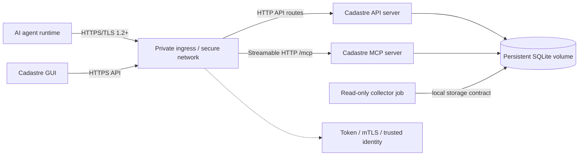
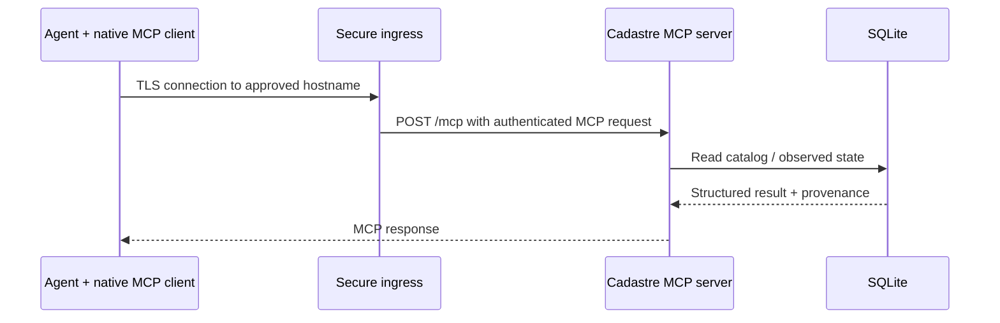
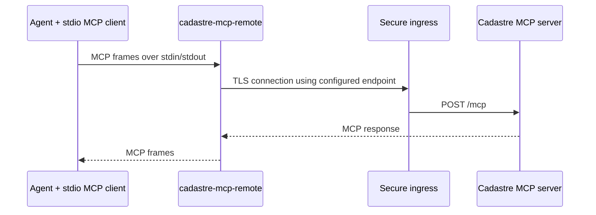
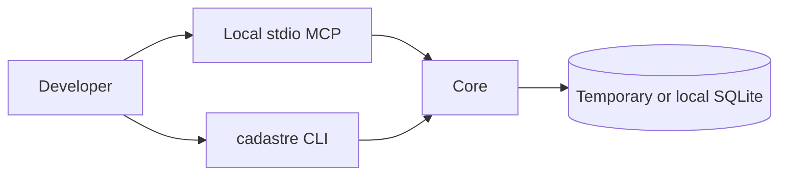
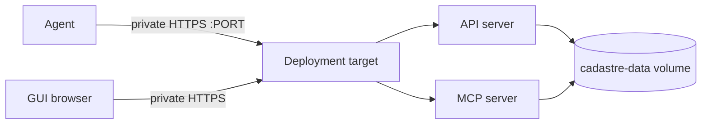
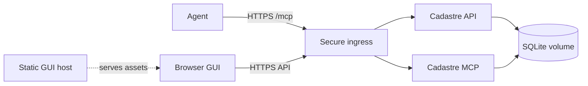

# Cadastre deployment design

This document defines how the Cadastre application stack is placed and how an
AI agent reaches it. It is a product deployment design, not a claim that any
particular estate has been deployed successfully.

## User paths: published artifacts and self-build

The normal open-source path is to pull the immutable backend and GUI image
digests published by the release pipeline and start the selected Compose
profile. Users do not need Git, a local compiler, or any part of the maintainer's
infrastructure for this path. The Python package and `cadastre-mcp-remote` are also published for
clients that do not use containers.

Users can self-build for a private registry, local patch, or unsupported
architecture:

```bash
uv build
docker build --pull -t cadastre:local .
docker build --pull -f Dockerfile.gui -t cadastre-gui:local .
```

For a daemonless build, use rootless BuildKit:

```bash
buildctl-daemonless.sh build --frontend dockerfile.v0 \
  --local context=. --local dockerfile=. \
  --output type=oci,name=cadastre:local,dest=cadastre.oci.tar
```

Self-built images are not official releases and do not carry the project's
published signature, SBOM, scan, or provenance attestations unless the
operator creates and verifies equivalent evidence.

## 1. Stack components

```text
cadastre-stack
  ├─ cadastre-db       SQLite files on a persistent volume
  ├─ cadastre-api      HTTP/API server and health/readiness
  ├─ cadastre-mcp      Streamable HTTP MCP server at /mcp
  ├─ cadastre-gui      Versioned static browser artifact, without data volume
  └─ cadastre-collector Optional separate read-only collection job

agent-runtime
  ├─ native MCP client  connects directly to cadastre-mcp
  └─ cadastre-mcp-remote local stdio bridge for clients without remote MCP
```

The database is not exposed on the network. The API and MCP services use the
same logical catalog and observed data model. They may be one process or two
processes, but the deployment must document which choice is made and must not
create independent databases accidentally.

## 2. Canonical secure remote flow



The ingress may be a direct Cadastre TLS listener or an operator-managed
reverse proxy. It must expose only the approved routes and must preserve the
following endpoint distinction:

```text
https://HOST:PORT/brief   ordinary HTTP/API response
https://HOST:PORT/mcp     standard Streamable HTTP MCP JSON-RPC
```

If API and MCP are separate listeners, each endpoint must have its own explicit
host/port/protocol record. They must not be documented as a single endpoint.

## 3. Agent client flows

### 3.1 Native MCP client



The client needs the remote MCP URL and its supported authentication setup. It
does not need the Cadastre Python package.

### 3.2 Stdio-only client with Cadastre bridge



The bridge must be installed on the agent host and must include the MCP client
dependency. It is a network client, not a second catalog server. Its endpoint
and token are supplied through environment/configuration or protected files;
they are not embedded in client JSON or command arguments. `REMOTE_ONLY=1`
means missing or unreachable remote state is an error, never permission to open
a local catalog.

## 4. Supported topology matrix

The GUI artifact and agent-client mode are part of the topology record. The GUI
must remain an HTTP/API client with no direct database path, as described in
[ARCHITECTURE.md](ARCHITECTURE.md); native MCP versus the local bridge is in
[AGENT-CLIENT.md](AGENT-CLIENT.md).

| Topology | Database | API | MCP | GUI | Agent access | Status |
|---|---|---|---|---|---|---|
| Local development | Local SQLite | Loopback process | Loopback/stdio | `cadastre-gui` static image | Local MCP or bridge | Supported |
| Single-host remote | Persistent volume | Same target | Same target | Same target or ingress assets | Private authenticated HTTPS | Target design |
| Split backend + GUI | Persistent volume | Backend target | Backend target | Separate static/app host | One secure ingress policy | Target design |
| External ingress | Persistent volume | Private backend | Private backend | Ingress-routed | Proxy identity, bearer, or mTLS | Supported boundary |
| Test harness | Temporary SQLite | Loopback | Loopback | Not required | Official MCP SDK | Implemented |

### 4.1 Local development



No remote credentials or external estate access is required.

### 4.2 Single-host remote application



The deployment target may run API and MCP as separate processes or as a
combined application service. The chosen shape must be explicit in the
deployment record. A shared SQLite volume requires coordinated backup,
locking, migration, and shutdown behavior.

### 4.3 Split backend and GUI



The GUI host must not receive the SQLite volume or application secrets. Browser
requests are authenticated by the selected identity mechanism and remain
subject to API authorization.

## 5. Ports and protocols

Internal container ports are implementation details; published ports belong in
the environment deployment record.

| Component | Internal endpoint | Protocol | Exposure |
|---|---|---|---|
| API server | `:8000` | HTTP or HTTPS depending on profile | Loopback or private ingress |
| MCP server | `:8001/mcp` in split mode | Streamable HTTP over HTTP/HTTPS | Loopback or private ingress |
| Combined listener, if implemented | one approved port with `/brief` and `/mcp` | HTTPS | Private/authenticated only |
| SQLite | filesystem only | SQLite | Never published |
| GUI assets | static host/ingress path | HTTPS | Same trust boundary as API |

No port number is safe to infer from a naming convention. Before an estate
deployment, Cadastre context and current collector evidence must confirm the
published port, bind address, hostname, network class, and collision state.

## 6. Identity and authentication

Every remote topology must record:

- TLS hostname and trust anchor;
- endpoint bind and published port;
- bearer principal and scopes, mTLS principal mapping, or proxy identity;
- allowed operations and whether catalog writes are enabled;
- token/certificate references, never values; and
- expiry, rotation, revocation, and failure behavior.

The agent-side bridge may read a protected token file because it must make a
remote request, but it must not print, log, or place the value in argv or a URL.
Native MCP clients use their own supported credential storage. Cadastre does not
require a particular secret manager.

## 7. Persistent operations

The deployment owner must define and test:

1. first initialization of an empty database;
2. schema migration and readiness behavior;
3. transaction-consistent backup of both SQLite databases;
4. restore into a clean volume and representative query parity;
5. graceful shutdown and restart persistence;
6. disk-full, integrity-failure, and unavailable-source behavior; and
7. exact application/configuration/image rollback.

The application does not automatically restore, roll back, or reconcile live
estate state.

### 7.0 Module configuration is persistent state

If the deployment enables an optional module, `modules.yaml` lives in the data
directory beside the databases and belongs to the volume, not the image. Losing
it does not corrupt anything, but it silently changes what the deployment is:
module entity kinds vanish from the schema, module routes stop existing, and
module rows stop being readable.

That last consequence is enforced rather than left to chance. The first write
of a module-owned row marks the catalog durably as requiring that module. An
application that has the module disabled will still serve base reads, but
refuses catalog writes, export, and import with a message naming `modules.yaml`
as the remediation. Physical `backup` and `restore` are unaffected and preserve
every byte, so the recovery path from a lost `modules.yaml` is to restore the
file, not the database.

Treat enabling a module as a change with a rollback story: back up first, and
keep `modules.yaml` in the same configuration management as the compose file
and the pinned digest. `GET /health/ready` reports a `modules` map, which is
the cheapest post-deploy check that the running container sees the activation
you think it does.

### 7.1 Upgrade procedure

`SECURITY.md` mandates a backup before an upgrade. This is what follows it. Run
it in order; every step is a place the upgrade can be abandoned at no cost up
until the container is started.

1. **Back up.** Take a transaction-consistent `cadastre backup` of both SQLite
   databases and confirm the copy restores into a fresh directory.
2. **Pull the new digest.** Releases publish `X.Y.Z`, `X.Y`, and `latest` as
   aliases of the immutable `sha-<commit>` tag. Resolve the alias to a digest
   and pin the digest — an alias is a lookup convenience, not a deployment
   reference.

   ```bash
   crane digest ghcr.io/<owner>/cadastre:X.Y.Z
   ```

3. **Verify the signature and attestations** before the image is allowed to
   run. An unverified image is not an upgrade candidate.

   ```bash
   cosign verify ghcr.io/<owner>/cadastre@<digest>
   cosign verify-attestation --type spdxjson ghcr.io/<owner>/cadastre@<digest>
   cosign verify-attestation --type slsaprovenance ghcr.io/<owner>/cadastre@<digest>
   cosign verify-attestation \
     --type https://github.com/TheDancingDeveloper-org/cadastre/schema-compatibility/v1 \
     ghcr.io/<owner>/cadastre@<digest>
   ```

   That third `--type` is a predicate type, not a URL to fetch; cosign accepts
   its own aliases or a URI, and nothing else.

4. **Compare the attested formats against the database on disk.** The
   schema-compatibility predicate carries `catalog_format_version` and
   `observed_format_version`. If either is ahead of what the running deployment
   wrote, the upgrade is a migration and step 1's backup is the only way back.
   `minimum_client_version` in the same predicate tells you whether installed
   `cadastre-mcp-remote` bridges need upgrading alongside the server.
5. **Start** the stack against the pinned digest.
6. **Confirm readiness.** `GET /health/ready` must report `lifecycle.state`
   `ready`, and its `modules` map must show the same activation as before the
   upgrade — a module that reads as disabled after an upgrade means the new
   container is not seeing `modules.yaml`, and the catalog will refuse writes
   until it does. `GET /version` reports the running `application_version` and
   the compatibility fields above. Then run `cadastre integrity-check`.
7. **Roll back** if readiness does not come up, integrity-check fails, or the
   reported `catalog_format_version` is not the one you verified: stop the
   stack, restore the step 1 backup into a clean volume, and start the
   previously pinned digest. Do not roll back a schema migration by starting
   the old image against the migrated database — the old application cannot
   read it, which is exactly what the `rollback` field of the compatibility
   document says.

## 8. Product versus environment

Product guarantees are defined in `ARCHITECTURE.md`, `DESIGN.md`, and the
application tests. Environment facts belong in the ops/deployment evidence:

- target host and runtime;
- image digest and signature verification;
- deployed profile and Compose hash;
- network/DNS/ingress path;
- certificate and secret references;
- volume ownership and backup location; and
- deployment and rollback owners.

An operator's estate record is one environment profile. It must not be used as
a product default or copied into the portable examples.
