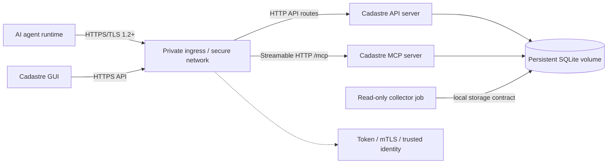
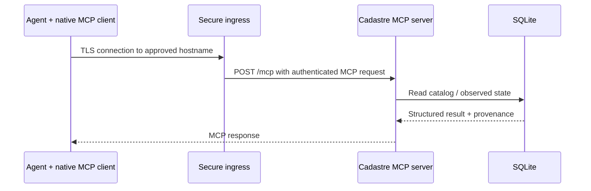
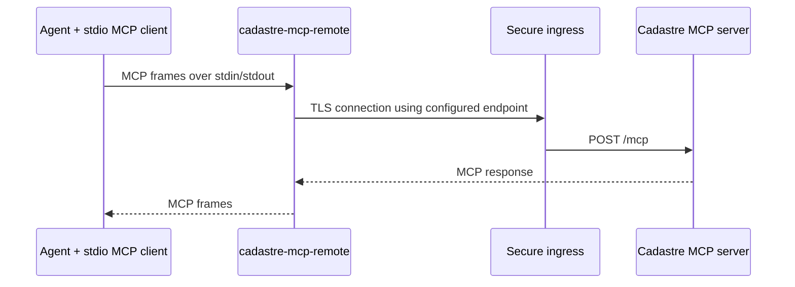
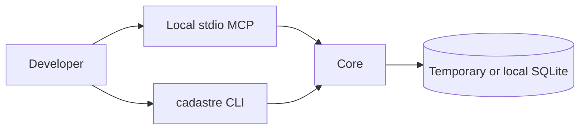
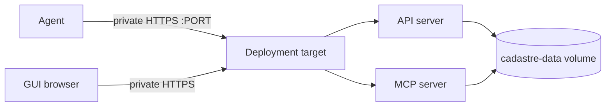
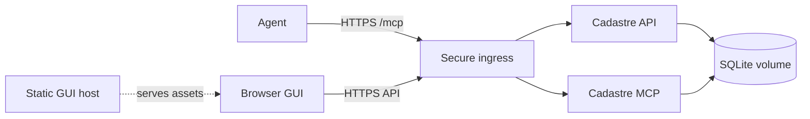

# Cadastre deployment design

This document defines how the Cadastre application stack is placed and how an
AI agent reaches it. It is a product deployment design, not a claim that any
particular estate has been deployed successfully.

## User paths: published artifacts and self-build

The normal open-source path is to pull the immutable backend and GUI image
digests published by the release pipeline and start the selected Compose
profile. Users do not need Git, a local compiler, or any part of the maintainer's
infrastructure for this path. The Python package and `cadastre-mcp-remote` are also published for
clients that do not use containers.

Users can self-build for a private registry, local patch, or unsupported
architecture:

```bash
uv build
docker build --pull -t cadastre:local .
docker build --pull -f Dockerfile.gui -t cadastre-gui:local .
```

For a daemonless build, use rootless BuildKit:

```bash
buildctl-daemonless.sh build --frontend dockerfile.v0 \
  --local context=. --local dockerfile=. \
  --output type=oci,name=cadastre:local,dest=cadastre.oci.tar
```

Self-built images are not official releases and do not carry the project's
published signature, SBOM, scan, or provenance attestations unless the
operator creates and verifies equivalent evidence.

## 1. Stack components

```text
cadastre-stack
  ├─ cadastre-db       SQLite files on a persistent volume
  ├─ cadastre-api      HTTP/API server and health/readiness
  ├─ cadastre-mcp      Streamable HTTP MCP server at /mcp
  ├─ cadastre-gui      Versioned static browser artifact, without data volume
  └─ cadastre-collector Optional separate read-only collection job

agent-runtime
  ├─ native MCP client  connects directly to cadastre-mcp
  └─ cadastre-mcp-remote local stdio bridge for clients without remote MCP
```

The database is not exposed on the network. The API and MCP services use the
same logical catalog and observed data model. They may be one process or two
processes, but the deployment must document which choice is made and must not
create independent databases accidentally.

### 1.1 Configuration reference

`compose.production.yaml` is substituted from `.env` in the working directory.
Copy [`.env.example`](.env.example) and edit it; the table below is the same
list, with the profiles each variable applies to.

Every variable has a default, so the stack starts without an `.env`. That is a
convenience for `local`, not a supported production posture — the two image
digests are placeholders that will not pull, and three of the directory mounts
fail *open*, as an empty mount rather than an error.

| Variable | Default | Applies to | Notes |
|---|---|---|---|
| `CADASTRE_IMAGE` | placeholder digest | all | **Required.** Pin by signed digest. |
| `CADASTRE_GUI_IMAGE` | placeholder digest | `direct-https`, `direct-mcp` | **Required** for those profiles. |
| `CADASTRE_BIND_IP` | `127.0.0.1` | all published ports | Loopback unless a proxy terminates traffic. |
| `CADASTRE_LOCAL_PORT` | `8000` | `local` | Plain HTTP, development only. |
| `CADASTRE_API_PORT` | `8443` | `direct-https` | |
| `CADASTRE_MCP_PORT` | `8444` | `direct-mcp` | Distinct from the API port. |
| `CADASTRE_GUI_PORT` | `8080` | `direct-https`, `direct-mcp` | |
| `CADASTRE_API_ORIGIN` | `https://localhost:8443` | GUI | As the *browser* resolves it; must match the certificate. |
| `CADASTRE_TLS_DIR` | `/etc/cadastre/tls` | `direct-https`, `direct-mcp` | Supplies `tls.crt`, `tls.key`. |
| `CADASTRE_AUTH_DIR` | `/etc/cadastre/auth` | `direct-https`, `direct-mcp` | Supplies `tokens`. |
| `CADASTRE_PROXY_DIR` | `/etc/cadastre/proxy` | `proxy` | Supplies `secret`. |
| `CADASTRE_PROXY_NETWORK` | `10.0.0.0/8` | `proxy` | CIDR the proxy may forward from. |
| `CADASTRE_PROXY_SCOPE` | `proxy=catalog.read` | `proxy` | Principal-to-scope mapping. |
| `CADASTRE_COLLECT_CONFIG_DIR` | `/etc/cadastre/collect` | `collector` | Plugin configuration. See the warning below. |
| `CADASTRE_COLLECT_ENV_FILE` | `/etc/cadastre/collect.env` | `collector` | Per-plugin credentials; optional. See §8. |
| `CADASTRE_INFISICAL_DIR` | `/etc/cadastre/infisical` | `collector` | Universal-auth `client_id`/`client_secret`. |
| `CADASTRE_INFISICAL_TOKEN_ENV` | `CADASTRE_P_SECRETS_TOKEN` | `collector` | Must match the source's `token_env`. |
| `CADASTRE_VOLUME` | `cadastre-data` | all | Renaming on a running deployment points the stack at an empty database (§7). |
| `CADASTRE_NETWORK` | `cadastre` | all | |

A bind-mount whose host path does not exist is created by the daemon as an
empty directory rather than refused. For `CADASTRE_COLLECT_CONFIG_DIR` that is
the consequential one: the collector starts, finds no sources configured,
collects nothing, and exits `0` like any other run. Section 8.5 is the check
that distinguishes it from a successful collection.

Compose substitution variables are not container environment. Nothing in this
table delivers a credential to a plugin; that is `CADASTRE_COLLECT_ENV_FILE`'s
job alone.

## 2. Canonical secure remote flow



The ingress may be a direct Cadastre TLS listener or an operator-managed
reverse proxy. It must expose only the approved routes and must preserve the
following endpoint distinction:

```text
https://HOST:PORT/brief   ordinary HTTP/API response
https://HOST:PORT/mcp     standard Streamable HTTP MCP JSON-RPC
```

If API and MCP are separate listeners, each endpoint must have its own explicit
host/port/protocol record. They must not be documented as a single endpoint.

## 3. Agent client flows

### 3.1 Native MCP client



The client needs the remote MCP URL and its supported authentication setup. It
does not need the Cadastre Python package.

### 3.2 Stdio-only client with Cadastre bridge



The bridge must be installed on the agent host and must include the MCP client
dependency. It is a network client, not a second catalog server. Its endpoint
and token are supplied through environment/configuration or protected files;
they are not embedded in client JSON or command arguments. `REMOTE_ONLY=1`
means missing or unreachable remote state is an error, never permission to open
a local catalog.

## 4. Supported topology matrix

The GUI artifact and agent-client mode are part of the topology record. The GUI
must remain an HTTP/API client with no direct database path, as described in
[ARCHITECTURE.md](ARCHITECTURE.md); native MCP versus the local bridge is in
[AGENT-CLIENT.md](AGENT-CLIENT.md).

| Topology | Database | API | MCP | GUI | Agent access | Status |
|---|---|---|---|---|---|---|
| Local development | Local SQLite | Loopback process | Loopback/stdio | `cadastre-gui` static image | Local MCP or bridge | Supported |
| Single-host remote | Persistent volume | Same target | Same target | Same target or ingress assets | Private authenticated HTTPS | Target design |
| Split backend + GUI | Persistent volume | Backend target | Backend target | Separate static/app host | One secure ingress policy | Target design |
| External ingress | Persistent volume | Private backend | Private backend | Ingress-routed | Proxy identity, bearer, or mTLS | Supported boundary |
| Test harness | Temporary SQLite | Loopback | Loopback | Not required | Official MCP SDK | Implemented |

### 4.1 Local development



No remote credentials or external estate access is required.

### 4.2 Single-host remote application



The deployment target may run API and MCP as separate processes or as a
combined application service. The chosen shape must be explicit in the
deployment record. A shared SQLite volume requires coordinated backup,
locking, migration, and shutdown behavior.

### 4.3 Split backend and GUI



The GUI host must not receive the SQLite volume or application secrets. Browser
requests are authenticated by the selected identity mechanism and remain
subject to API authorization.

## 5. Ports and protocols

Internal container ports are implementation details; published ports belong in
the environment deployment record.

| Component | Internal endpoint | Protocol | Exposure |
|---|---|---|---|
| API server | `:8000` | HTTP or HTTPS depending on profile | Loopback or private ingress |
| MCP server | `:8001/mcp` in split mode | Streamable HTTP over HTTP/HTTPS | Loopback or private ingress |
| Combined listener, if implemented | one approved port with `/brief` and `/mcp` | HTTPS | Private/authenticated only |
| SQLite | filesystem only | SQLite | Never published |
| GUI assets | static host/ingress path | HTTPS | Same trust boundary as API |

No port number is safe to infer from a naming convention. Before an estate
deployment, Cadastre context and current collector evidence must confirm the
published port, bind address, hostname, network class, and collision state.

## 6. Identity and authentication

Every remote topology must record:

- TLS hostname and trust anchor;
- endpoint bind and published port;
- bearer principal and scopes, mTLS principal mapping, or proxy identity;
- allowed operations and whether catalog writes are enabled;
- token/certificate references, never values; and
- expiry, rotation, revocation, and failure behavior.

The agent-side bridge may read a protected token file because it must make a
remote request, but it must not print, log, or place the value in argv or a URL.
Native MCP clients use their own supported credential storage. Cadastre does not
require a particular secret manager.

## 7. Persistent operations

The deployment owner must define and test:

1. first initialization of an empty database;
2. schema migration and readiness behavior;
3. transaction-consistent backup of both SQLite databases;
4. restore into a clean volume and representative query parity;
5. graceful shutdown and restart persistence;
6. disk-full, integrity-failure, and unavailable-source behavior; and
7. exact application/configuration/image rollback.

The application does not automatically restore, roll back, or reconcile live
estate state.

### 7.0 Module configuration is persistent state

If the deployment enables an optional module, `modules.yaml` lives in the data
directory beside the databases and belongs to the volume, not the image. Losing
it does not corrupt anything, but it silently changes what the deployment is:
module entity kinds vanish from the schema, module routes stop existing, and
module rows stop being readable.

That last consequence is enforced rather than left to chance. The first write
of a module-owned row marks the catalog durably as requiring that module. An
application that has the module disabled will still serve base reads, but
refuses catalog writes, export, and import with a message naming `modules.yaml`
as the remediation. Physical `backup` and `restore` are unaffected and preserve
every byte, so the recovery path from a lost `modules.yaml` is to restore the
file, not the database.

Treat enabling a module as a change with a rollback story: back up first, and
keep `modules.yaml` in the same configuration management as the compose file
and the pinned digest. `GET /health/ready` reports a `modules` map, which is
the cheapest post-deploy check that the running container sees the activation
you think it does.

### 7.1 Upgrade procedure

`SECURITY.md` mandates a backup before an upgrade. This is what follows it. Run
it in order; every step is a place the upgrade can be abandoned at no cost up
until the container is started.

1. **Back up.** Take a transaction-consistent `cadastre backup` of both SQLite
   databases and confirm the copy restores into a fresh directory.
2. **Pull the new digest.** Releases publish `X.Y.Z`, `X.Y`, and `latest` as
   aliases of the immutable `sha-<commit>` tag. Resolve the alias to a digest
   and pin the digest — an alias is a lookup convenience, not a deployment
   reference.

   ```bash
   crane digest ghcr.io/<owner>/cadastre:X.Y.Z
   ```

3. **Verify the signature and attestations** before the image is allowed to
   run. An unverified image is not an upgrade candidate.

   ```bash
   cosign verify ghcr.io/<owner>/cadastre@<digest>
   cosign verify-attestation --type spdxjson ghcr.io/<owner>/cadastre@<digest>
   cosign verify-attestation --type slsaprovenance ghcr.io/<owner>/cadastre@<digest>
   cosign verify-attestation \
     --type https://github.com/TheDancingDeveloper-org/cadastre/schema-compatibility/v1 \
     ghcr.io/<owner>/cadastre@<digest>
   ```

   That third `--type` is a predicate type, not a URL to fetch; cosign accepts
   its own aliases or a URI, and nothing else.

4. **Compare the attested formats against the database on disk.** The
   schema-compatibility predicate carries `catalog_format_version` and
   `observed_format_version`. If either is ahead of what the running deployment
   wrote, the upgrade is a migration and step 1's backup is the only way back.
   `minimum_client_version` in the same predicate tells you whether installed
   `cadastre-mcp-remote` bridges need upgrading alongside the server.
5. **Start** the stack against the pinned digest.
6. **Confirm readiness.** `GET /health/ready` must report `lifecycle.state`
   `ready`, and its `modules` map must show the same activation as before the
   upgrade — a module that reads as disabled after an upgrade means the new
   container is not seeing `modules.yaml`, and the catalog will refuse writes
   until it does. `GET /version` reports the running `application_version` and
   the compatibility fields above. Then run `cadastre integrity-check`.
7. **Confirm something still collects.** A ready query stack never collects on
   its own; `cadastre-collector` sits behind a Compose profile and runs only
   when an external scheduler runs it (section 8). An upgrade is a common place
   to lose that scheduler, because the unit, cron entry, or CronJob lives
   outside the compose file being replaced. `GET /sources` proves the plugins
   are configured and handshaking, not that anything was collected — it runs a
   live `plugin.info` and answers `ok` for a stack that has never collected at
   all. The evidence of a run is a query's `provenance` block showing a recent
   `as_of` per source, so run one collection by hand and read it (section 8.5).
8. **Roll back** if readiness does not come up, integrity-check fails, or the
   reported `catalog_format_version` is not the one you verified: stop the
   stack, restore the step 1 backup into a clean volume, and start the
   previously pinned digest. Do not roll back a schema migration by starting
   the old image against the migrated database — the old application cannot
   read it, which is exactly what the `rollback` field of the compatibility
   document says.

## 8. Scheduling the containerised collector

The compose stack defines `cadastre-collector` as a job, not a service:
`profiles: [collector]` keeps it out of `docker compose up`, and
`restart: "no"` makes it run to completion. Both are deliberate — Cadastre does
not daemonize (`DESIGN.md` §2.5) — and together they mean the stack contains no
mechanism that will ever start it. Nothing errors if the estate never adds one.
The API stays healthy, `GET /sources` keeps reporting every plugin `ok`, and
the catalog serves observations that get older forever.

Scheduling is therefore a deployment decision the image cannot make. One run is
one command:

```bash
docker compose --profile collector run --rm cadastre-collector
```

`run` rather than `up`, because the service is a job and `up` would wait on a
process that is supposed to exit. `--profile collector` because the profile is
what keeps it out of the ordinary stack. `--rm` because every run otherwise
leaves a stopped container behind, and a year of hourly collection is 8,760 of
them. No arguments: the service already carries its entrypoint, command, data
volume, and configuration mounts.

Credentials are the one thing it does not carry by default. A
`secrets-infisical` source needs none: the entrypoint performs a universal-auth
login from `CADASTRE_INFISICAL_DIR` and mints a short-lived token into the
process environment. Every other plugin — forge, CI, DNS, VPN, hypervisor —
reads a `CADASTRE_P_*` variable named by its `token_env`, and those arrive
through the collector's `env_file`:

```yaml
env_file:
  - path: ${CADASTRE_COLLECT_ENV_FILE:-/etc/cadastre/collect.env}
    required: false
```

Populate it from [`examples/collector/collect.env.sample`](examples/collector/collect.env.sample),
which names one variable per plugin and states the minimum scope each needs.
`required: false` keeps an Infisical-only estate working without the file; the
cost is that a *missing* file is indistinguishable from a correct one until
§8.5 tells you which sources actually reported. The long `env_file` form that
carries `required` needs Compose v2.24 or newer; on anything older the key is
rejected outright rather than ignored, which at least fails loudly.

Do not expect `--env-file` to do this. It populates Compose *substitution* —
the `${CADASTRE_*}` values in this document — and never reaches inside a
container. A `CADASTRE_P_DNS_TOKEN` set there is read by Compose, matched
against nothing, and silently dropped.

The three recipes below wrap that one command. They are shapes, not a
recommendation between orchestrators — pick whichever timer the estate already
operates and monitors, because a scheduler nobody watches is the failure this
section exists to prevent.

### 8.1 One shot per run is the contract

Each run is a fresh container, and that is a security property rather than an
implementation detail. The collector's entrypoint,
[`scripts/infisical-entrypoint.py`](scripts/infisical-entrypoint.py), performs a
universal-auth login using the client-id/secret mounted read-only at
`/run/cadastre/infisical/`, exports the short-lived access token it mints into
the variable(s) named by `INFISICAL_TOKEN_ENV`, and `exec`s `cadastre collect`.
The token exists only in that one process's environment, for the length of that
one run. It is never written to `cadastre-data` and never logged, and when the
process exits its only copy goes with it.

The obvious-looking alternative — one long-running container looping
`collect; sleep 3600`, or the same service with `restart: unless-stopped` —
**is not recommended, and breaks that property.** It mints one token and holds
it for the container's whole lifetime, so the credential's short expiry becomes
decorative, a rotation or revocation upstream is picked up only on restart, and
a token that outlives its own validity turns a scheduling problem into a silent
authentication failure on every subsequent iteration. It also removes the one
thing an external scheduler gives you for free: a run boundary the estate's
existing monitoring can see and alert on.

Estates not using Infisical drop the entrypoint override and go back to
`command: [collect]` with a static `token_env` credential, as the comment in
`compose.production.yaml` describes. The one-shot shape still applies: a static
credential in a container that never restarts is a credential that never gets
re-read.

### 8.2 cron

```cron
17 * * * * cd /srv/cadastre && /usr/bin/docker compose --env-file /srv/cadastre/.env -f /srv/cadastre/compose.production.yaml --profile collector run --rm cadastre-collector >>/var/log/cadastre-collect.log 2>&1
```

Every absolute path in that line is load-bearing. `cron` runs with a minimal
environment, no working directory you chose, and frequently no `docker` on
`PATH`; the compose file is also full of `${CADASTRE_*}` substitutions, so the
`--env-file` that an interactive `docker compose` picks up from the current
directory has to be named explicitly. A cron entry that works when pasted into
a login shell and fails from `crontab` is almost always one of those three.

The offset minute spreads collection off the top of the hour, where every other
scheduled job in the estate already is.

Do not read a silent cron as a successful collection. `cadastre collect` exits
`0` when a source fails: a plugin that cannot reach its upstream renders as a
`STALE` row in the run's output and a stale source in every answer that depends
on it, which is the designed behaviour (`DESIGN.md` §2.5) but not something
cron's mail-on-failure will ever tell you about. A non-zero exit means compose,
the entrypoint, or the catalog itself failed — a coarser signal than the one
you actually want. Section 8.5 is the check that covers the difference.

### 8.3 systemd timer

The same timer shape as [`examples/collector/`](examples/collector/README.md),
with the host install removed: no `useradd`, no `uv tool install`. The unit's
only dependency is the container runtime.

The host does still hold the collector's credential file unless every
configured source is `secrets-infisical` — `CADASTRE_COLLECT_ENV_FILE`, mode
`0400`, exactly as the host recipe uses it. What the container path removes is
the Python install and the service account, not the credentials themselves.

```ini
# /etc/systemd/system/cadastre-collect.service
[Unit]
Description=Cadastre — collect observed evidence from the estate
After=docker.service network-online.target
Wants=network-online.target

[Service]
Type=oneshot
WorkingDirectory=/srv/cadastre
ExecStart=/usr/bin/docker compose --env-file /srv/cadastre/.env \
  -f /srv/cadastre/compose.production.yaml \
  --profile collector run --rm cadastre-collector
# A hung plugin must not wedge the timer; the plugin runner has its own
# per-call timeout, this is the backstop for the whole run.
TimeoutStartSec=15min
```

```ini
# /etc/systemd/system/cadastre-collect.timer
[Timer]
OnCalendar=hourly
RandomizedDelaySec=5min
Persistent=true

[Install]
WantedBy=timers.target
```

`Persistent=true` is the reason to prefer this over cron on a host that reboots
or suspends: a missed run fires on the next boot instead of waiting for the
next slot, which matters when the interval is close to the freshness threshold.
The container-level hardening that `examples/collector/`'s unit applies to the
host process (`ProtectSystem`, `NoNewPrivileges`, and the rest) is already in
`compose.production.yaml` as `read_only`, `cap_drop: [ALL]`,
`no-new-privileges`, and a non-root `user:` — applying it to the `docker`
client as well buys nothing and will break the socket connection.

### 8.4 Kubernetes CronJob

```yaml
apiVersion: batch/v1
kind: CronJob
metadata:
  name: cadastre-collect
spec:
  schedule: "17 * * * *"
  concurrencyPolicy: Forbid
  successfulJobsHistoryLimit: 3
  jobTemplate:
    spec:
      template:
        spec:
          restartPolicy: OnFailure
          securityContext:
            runAsUser: 10001
            runAsGroup: 10001
          containers:
            - name: collector
              image: ghcr.io/<owner>/cadastre@sha256:<pinned digest>
              command: [python, /app/scripts/infisical-entrypoint.py]
              args: [cadastre, collect]
              env:
                - name: CADASTRE_DATA_DIR
                  value: /var/lib/cadastre
                - name: INFISICAL_CLIENT_ID_FILE
                  value: /run/cadastre/infisical/client_id
                - name: INFISICAL_CLIENT_SECRET_FILE
                  value: /run/cadastre/infisical/client_secret
              securityContext:
                readOnlyRootFilesystem: true
                allowPrivilegeEscalation: false
                capabilities: {drop: [ALL]}
              volumeMounts:
                - {name: data, mountPath: /var/lib/cadastre}
                - {name: tmp, mountPath: /tmp}
                - {name: infisical, mountPath: /run/cadastre/infisical, readOnly: true}
          volumes:
            - name: tmp
              emptyDir: {medium: Memory, sizeLimit: 64Mi}
            - name: data
              persistentVolumeClaim: {claimName: cadastre-data}
            - name: infisical
              secret: {secretName: cadastre-infisical, defaultMode: 0400}
```

`concurrencyPolicy: Forbid` is not optional. The collector writes
`observed.sqlite3` on the same volume the API and MCP pods read, and two
overlapping runs against one SQLite file is the case the storage contract does
not cover. A slow upstream that makes a run overrun its schedule is precisely
when a second run would otherwise start.

The data volume is the same claim the query pods mount, which on an RWO class
pins the CronJob to their node. That constraint is real and worth recording in
the topology matrix rather than discovering when the job goes unschedulable.
The in-memory `/tmp` is the compose `tmpfs` entry, which
`readOnlyRootFilesystem` would otherwise take away.

The credential mount is a Secret projected as files, matching the entrypoint's
`_FILE` convention; the plain `INFISICAL_CLIENT_ID`/`INFISICAL_CLIENT_SECRET`
variables exist only for deployment mechanisms with no secret-file mount to
offer, and Kubernetes is not one of them.

### 8.5 Verifying that collection actually happens

Three checks, in order, because each rules out something the next one cannot.

1. **Run it once by hand.** `docker compose --profile collector run --rm
   cadastre-collector` prints one row per configured source. Every row should
   read `ok`; a `STALE` row names the source and the error, and the run still
   exits `0`.
2. **`GET /sources`** (or `cadastre sources`) runs the `plugin.info` handshake
   live against every configured source. It separates "not configured" from
   "configured and failing" — but it says nothing about when anything was last
   collected, and a stack that has never collected once still reports every
   source `ok`. It is the second check, never the only one.
3. **Read a query's provenance.** `GET /brief`, or any answer, carries a
   `provenance` entry per source with `as_of`, `ttl_seconds`, and `stale`. A
   recent `as_of` is the only evidence that a scheduled run wrote something.
   `GET /stale` is the same information filtered to what has aged past its
   threshold, and is the cheapest thing to put on a recurring check.

### 8.6 Choosing the interval

A source collected less often than its freshness threshold renders as `STALE`,
correctly and permanently. The default threshold is 24 hours and individual
capabilities are tighter (`BUILTIN_PLUGINS.md`); `freshness:` in the plugin
configuration overrides them per source. Match the interval to the tightest
threshold the estate actually acts on, and loosen the thresholds it does not —
an hourly timer against a 15-minute threshold produces a source that is stale
three quarters of the time and teaches everyone to ignore the flag.

## 9. Product versus environment

Product guarantees are defined in `ARCHITECTURE.md`, `DESIGN.md`, and the
application tests. Environment facts belong in the ops/deployment evidence:

- target host and runtime;
- image digest and signature verification;
- deployed profile and Compose hash;
- network/DNS/ingress path;
- certificate and secret references;
- volume ownership and backup location; and
- deployment and rollback owners.

An operator's estate record is one environment profile. It must not be used as
a product default or copied into the portable examples.
